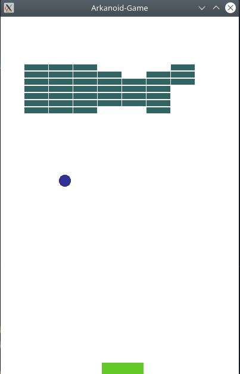
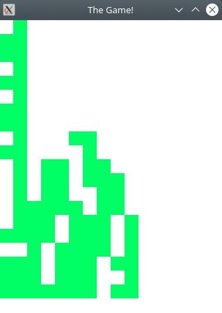

<b>[Task 1](/Tasks/task_1/)</b> 
> Сумма делителей натурального числа

<b>[Task 2](/Tasks/task_2/)</b>
> Чтение протокола

<b>[Task 3](/Tasks/task_3/)</b>
> Арканоид sfml
 

<b>[Task 4](/Tasks/task_4/)</b>
> Тетрис sfml
 
